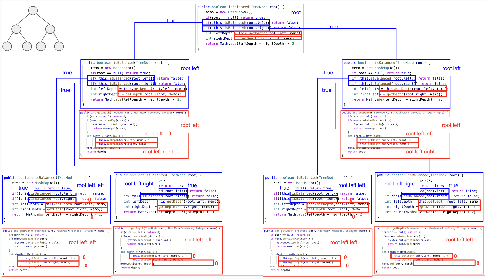
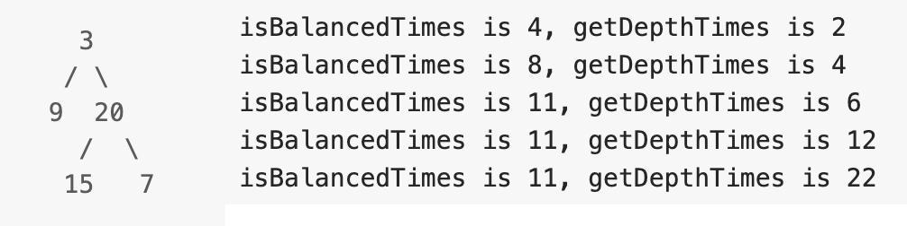
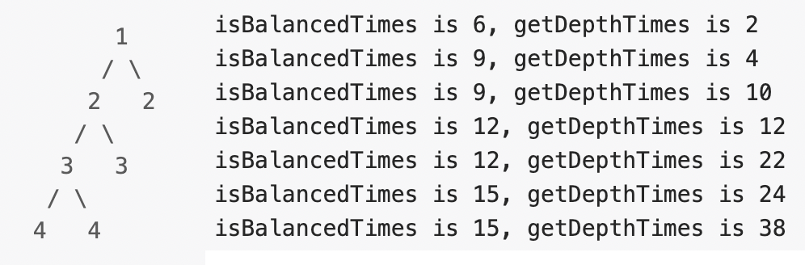
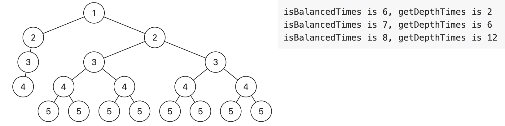
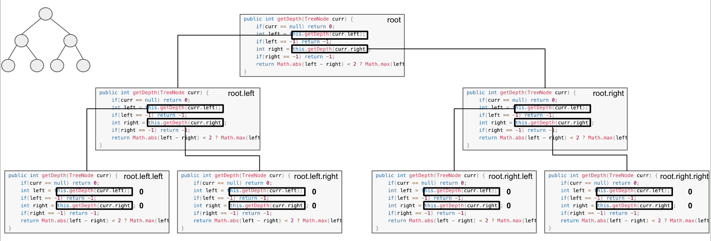
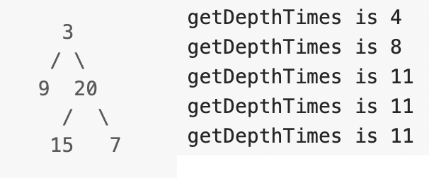
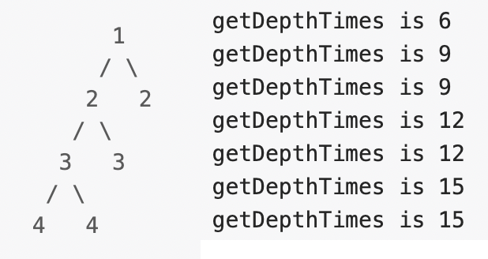
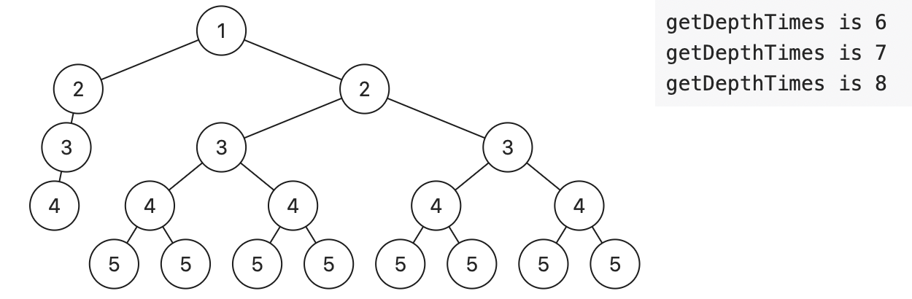

# algorithms
## recursion
There are two solutions. 
* `Solution 1` uses two functions: one to get the depth of the subtree and another one to judge if a certain node is a 
balanced binary tree.
* `Solution 2` uses only one function to judge if a certain node is a balanced binary tree.

**Solution 1**
This is the illustration of the `Solution1`  

In `Solution1`, from the graph:
1. `isBalanced` function is called recursively on each node.
2. `getDepth` function is called recursively by all sub-nodes of a certain node.  

The following graph is 

We define `N` as the total number of nodes, including null nodes. In `Case 1`, which contains 11 nodes, `isBalanced` is called 
11 times. To determine the number of times `getDepth` is called, we can refer to a table for calculation.

| node position    | sub-nodes it has |
|------------------|------------------|
| root             | 10               |
| root.left        | 2                |
| root.right       | 6                |
| root.right.left  | 2                |
| root.right.right | 2                |

So the total is 22.

The same as `Case 2`.  

To calculate the time complexity, we define `l` as the number of layer. We know that $l = log_2(N+1)$ for a perfect balanced tree.
* `isBalanced` function is called `N` times.
* `getDepth` function is called $N - (2^0 - 1) + N - (2^1 - 1) + N - (2^2 - 1) + ... + N - (2^{l-1} - 1) = Nl - 2^l - 1 - l = (N-1)log_2(N+1) - N$.
* The total is $(N-1)log_2(N+1)$

So, the time complexity is $O(NlogN)$

**Optimization**: Both `Memorandum` and `Pruning` are employed. This is how `Pruning` works. You can see only left subtree
is visited.

**Solution 2**

This is the illustration of the `Solution2`  

`Solution 2` only uses one function to get the depth of the subtree and judge the balance of the subtree.  
It is much quicker than the `Solution 1`.

**Optimization**: `Pruning` is employed, where `this.getDepth(curr.right)` is skipped if `this.getDepth(curr.left) == -1`.
This is how `Pruning` works. You can see only left subtree is visited.

