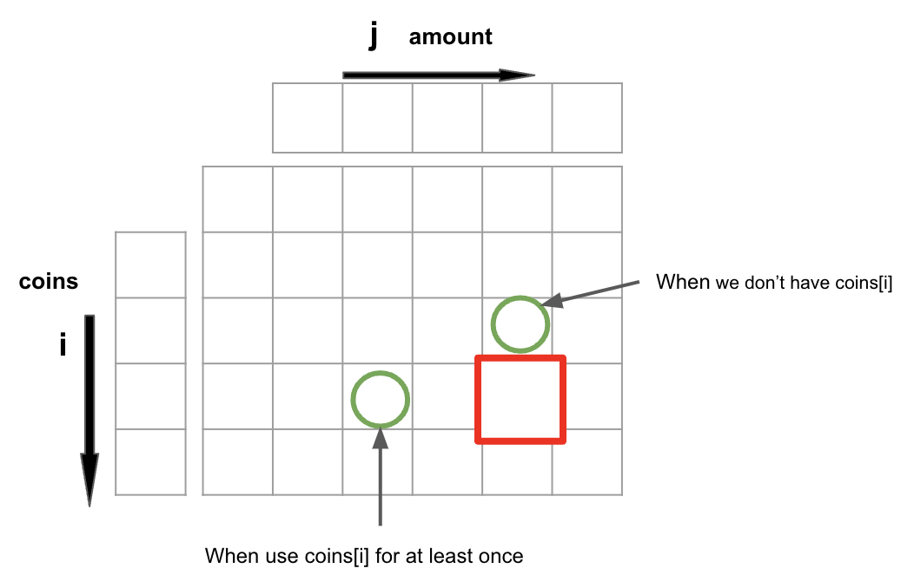

# algorithms
## dynamic programming
### 1-D dynamic programming matrix
This problem is relatively simple, but please note there are some caveats to consider. Please refer to the attached 
image for further clarity.

# caveats
## dynamic programming
### misunderstanding of function
1. Should we include `dp2[j - coin * 2]` in our count, or is `dp1[j]` and `dp2[j - coin]` sufficient? This confusion 
arose due to a misunderstanding of `dp2[x]`.
   1. `dp2[x]` represents the number of combinations that can be formed to achieve the amount `x` using the available 
   coins `coins[0]`, `coins[1]`, ... `coins[i]`. It's important to note that having these coins does not necessarily 
   require their use in the combination, and it's possible to use a coin multiple times while excluding others.
   2. `dp2[x - coin]` represents the number of combinations that can be formed to achieve the amount `x` using the 
   available coins, including coin used at least once. Thus, `dp2[x - coin]` already encompasses `dp2[x - 2 * coin]`
   (which would mean using `coin` at least twice), which is why we only need to consider `dp2[x - coin]`.

