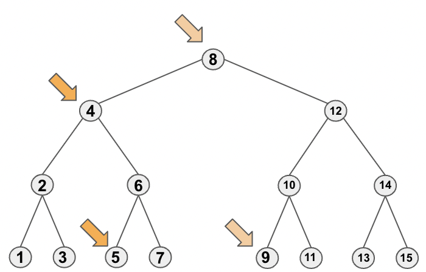

# Note of Convert Binary Search Tree to Sorted Doubly Linked List
This serves as an excellent and timeless illustration of how to traverse a binary search tree by inorder traversal.
## Inorder Traversal of Binary Search Tree
We utilize the following code prototype for performing inorder traversal on a binary search tree: We start by traversing 
through the left arm of the root node until we reach the leaf node at the bottom and set it as the current node, then we 
move on to its sibling (its parent's right node) subtree and traverse through the left arm again until the end (leftmost node). 
This pattern is applied recursively.
```java
pubilc void dfs(Node curr) {
    if(curr == null) return;
    dfs(curr.left);
    // handle with curr
    dfs(curr.right);    
}
```
In the current question, we employ the same approach. Furthermore, we define a class variable `prev`, please notice that
the `prev` is unnecessarily points to its left child node.  

For example, the `node 4` and its successive node `node 5` is not adjacent.
  

From this question, we can glean two key points:
1. Utilizing the provided code prototype confirms the ability to traverse the tree in the order depicted in the picture.
2. In certain cases, employing class variables instead of passing variables directly into the `dfs` function can enhance 
understanding and facilitate ease of operation.