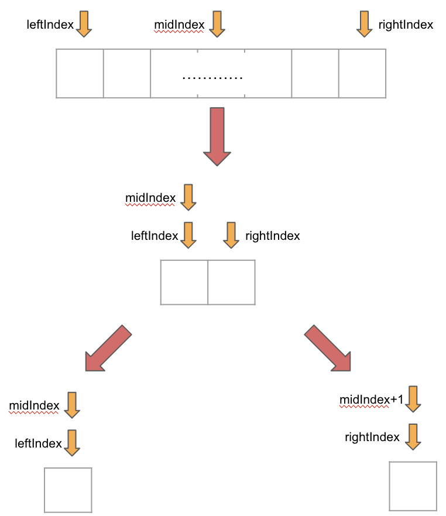

# Note of Find Minimum in Rotated Sorted Array II
## Dichotomy
When using a dichotomous approach, determining the range for the next and final iteration can be challenging. However, 
by bearing in mind the following criteria, we can make this process considerably more manageable.

1. If we are using `midIndex = (leftIndex + rigthIndex) / 2`, 
   1. Remember that `midIndex >= leftIndex`.
   2. Remember that `midIndex < rightIndex`.
So, we can use this code snippet:
```java
public void dfs(int[] numbers, int leftIndex, int rightIndex) {
    if(leftIndex == rightIndex) {
        // finish it
    }
    int midIndex = (leftIndex + rightIndex) / 2;
    
    dfs(leftIndex, midIndex); // put the left part into the next iteration
    dfs(midIndex + 1, rightIndex); // put the right part into the next iteration
}
```
Here is a visual representation of the dichotomous process to completion, which always culminates in the `leftIndex` and 
`rightIndex` converging.  

