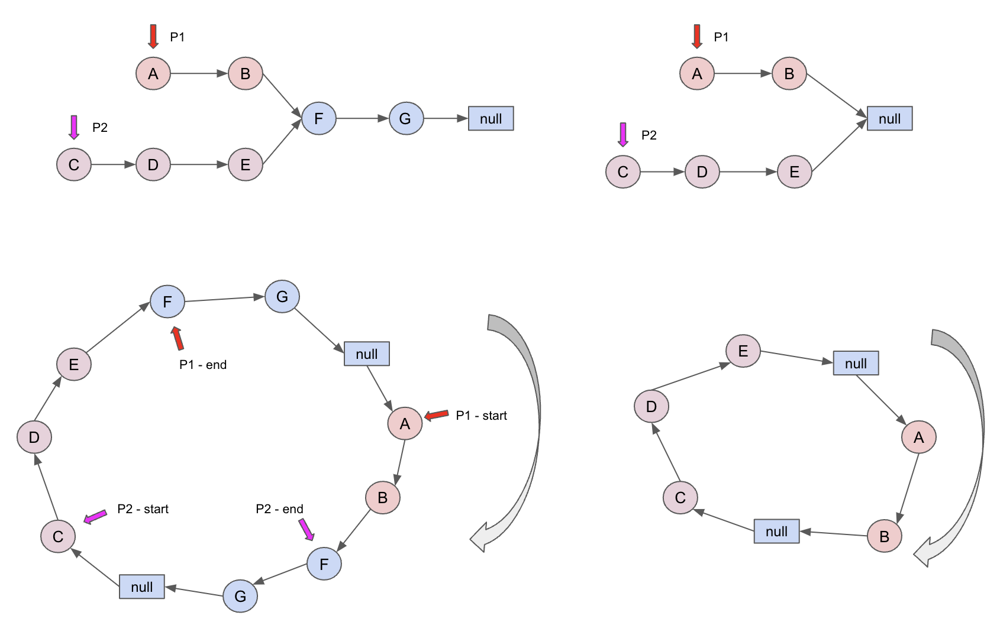

# Note of Intersection of Two Linked Lists
## MobiusBand
Don't forget to consider the presence of a null node at the end of the linked list when solving the problem.

Then problem can be solved by making a Mobius Band like this 