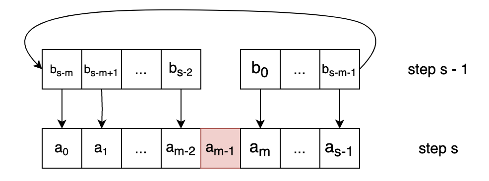

# types
## josephus problem

# algorithms
## josephus problem
This problem can be solved by using dynamic programming.  

To solve this question, let's ask: "If we know the survivor's index in the last step (which is 0 because it's the only element remaining), what's the survivor's index in the second-to-last step?" Since each step involves eliminating an element and rearranging the array, the survivor in the second-to-last step might have a different index. If we can solve this, we can find the survivor's index in the third-to-last step, fourth-to-last step, and so on, until the first step.

Generalizing, if we know the survivor's index in step $s−1$, what's the survivor's index in step $s$, where $n$ represents the number of remaining elements?

Let's illustrate this with an image:

Let $x$ be the index of the survivor element in `step s-1` (0-indexed). The corresponding index in `step s` (0-indexed) can be determined using the formula $(x + m) \mod{s}$, where $m$ denotes the m-th element removed in each loop. Since arrays are 0-indexed, the index of the m-th element should be $m - 1$. For an element indexed as $x$ at `step s - 1`, its corresponding element index at `step s` is:

$$f(x, s - 1) = (x + m) \mod{s}$$

For a more general form, we have

$$f(x, s) = (x + m) \mod{s + 1}$$

Let's reiterate the significance of this equation: for an element indexed as $x$ (0-indexed array) in `step s`, the index of its corresponding element in `step s + 1` is give by $(x + m) \mod{s + 1}$.

Starting from $f(0, 1)$, representing the survivor element in `step 1`, we obtain $m \mod{s + 1}$, signifying the index of the survivor element in `step 2`. We then substitute $m \mod{s + 1}$ into the function to derive $f(m \mod{s + 1}, 2)$, which denotes the index of the survivor element in `step 3`. This process continues until we reach `step n`.

One key observation is that for any positive integer $n$ and integer $t$ where $t \lt n$:

$$(n + t) \mod{n} = t$$