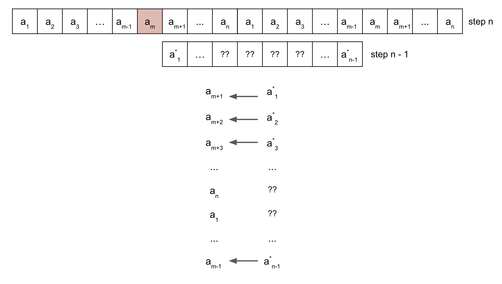

# types
## josephus problem

# algorithms
## josephus problem
This problem can be solved by using dynamic programming.  

To solve this question, let's ask: "If we know the survivor's index in the last step (which is 0 because it's the only element remaining), what's the survivor's index in the second-to-last step?" Since each step involves eliminating an element and rearranging the array, the survivor in the second-to-last step might have a different index. If we can solve this, we can find the survivor's index in the third-to-last step, fourth-to-last step, and so on, until the first step.

Generalizing, if we know the survivor's index in step $n−1$, what's the survivor's index in step $n$, where $n$ represents the number of remaining elements?

Let's illustrate this with an image:

Assuming that we utilize $x$ to represent the index of the survivor element in `step n-1`, we can derive the corresponding index in `step n` as $(x + m) \mod{n}$. Therefore, we can express the relationship between the indices of the survivor element in `step n` and `step n-1` mathematically as follows:

$$f(n) = (f(n-1) + m) \mod{n}$$

One key observation is that for any positive integer $n$ and integer $t$ where $t \lt n$:

$$(n + t) \mod{n} = t$$