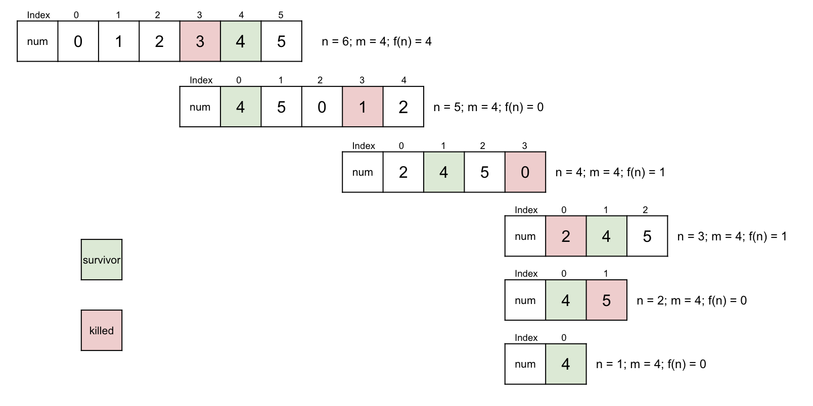

# Note of Last Remaining Number in Circle
## Josephus Problem
This problem can be solved by using dynamic programming.  

To ensure clarity in our approach, we construct an array $a_1, a_2, ..., a_n$. Notably, the only certainty we have is 
that when only one element remains in the array, the index of the survivor must be 0. Therefore, leveraging the index 
component is crucial in solving this problem using dynamic programming.

Let us define $f(n)$ as the index of the survivor element when there are still $n$ elements left, while $f(n-1)$ represents 
the index of the survivor element when $n-1$ elements are left in the array. It is important to note that both $f(n)$ and 
$f(n-1)$ index to the same number, although their respective indices may differ. This can be visualized through the 
following diagram:

Let us establish the notion of `level n` to denote the scenario where there are $n$ elements remaining in the array. Given 
this framework, the key question at hand is: if we already know the index of the survivor element in `level n-1`, what 
is its corresponding index in `level n`?

The following image serves to illustrate the relationship between the survivor element's indices in `level n-1` and `level n`.

Assuming that we utilize $x$ to represent the index of the survivor element in `level n-1`, we can derive the corresponding 
index in `level` n as $(x + m) % n$. Therefore, we can express the relationship between the indices of the survivor element 
in `level n` and `level n-1` mathematically as follows:
$$f(n) = (f(n-1) + m) \mod{n}$$