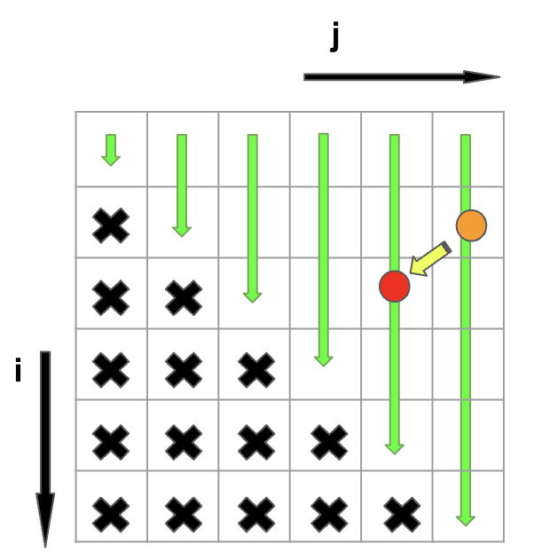
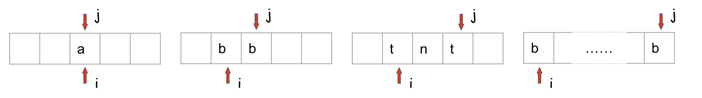

This problem involves dynamic programming applied to substring manipulation. As with similar problems, we can use a matrix 
to assist us in finding the optimal solution.:

To construct this matrix, we must consider three key questions:

1. How should we initialize the matrix? Do we need to add padding to the input string to simplify the problem?
2. What is the transition equation that allows us to update the current grid based on the previous ones?
3. In what order should we fill in the cells of the matrix to ensure that we have all the necessary information for the 
final solution?"

The matrix is here: 
The matrix `dp[i][j]` represents whether the substring `s.substring(i, j + 1)` is a palindrome or not. Since `i` should 
always be less than or equal to `j`, we do not need to fill in the lower half of the matrix.

To determine the values of the matrix, we can follow these guidelines:

1. We do not need to add padding, and `dp[0][0]` should always be true.
2. For each `dp[i][j]` entry, we can typically compute its value based on `dp[i+1][j-1]`. In the image, to calculate the value 
of the orange cell, we first need to know the value of the red cell. However, there are two special cases:
   1. When `i` equals `j`, the substring is a palindrome, so `dp[i][j]` should be set to true. 
   2. When `j - i = 1`, we need to check whether `s[i]` and `s[j]` are equal to determine if the substring is a palindrome.
3. We should fill in the cells of the matrix in the order indicated by the green arrows.

