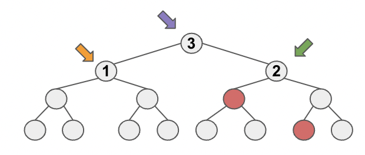

# Note of The Lowest Common Ancestor of a Binary Tree
## dfs
### Solution 1
To get both `q` and `p`, we need to traverse all nodes until we find it.

## Solution 2
This solution relies on the premise that the lowest common ancestor shares two target nodes on opposite sides. Based on 
this, three scenarios arise:

1. Case 1: No target nodes on both side, return null.
2. Case 2: The current node has target nodes on both side, return the current node.
3. Case 3: Both target nodes are on the same side (e.g., right side of `Node 2` in the image), resulting in a null 
return on the opposite side, and the lowest common ancestor on the same side. 