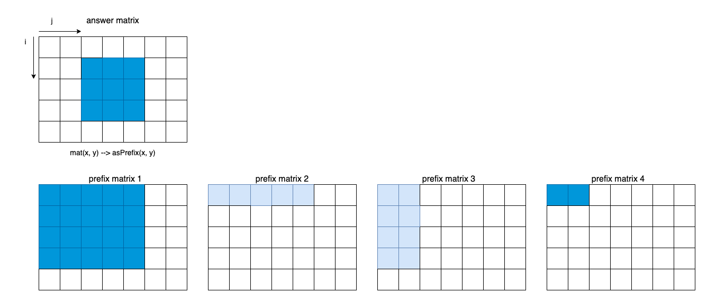
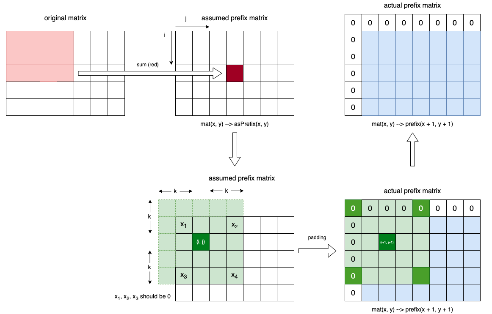
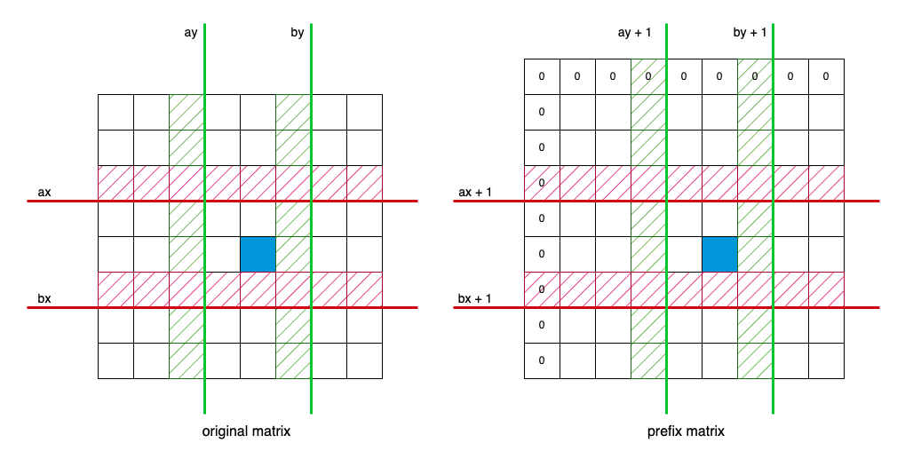

## Algorithm or Skills
# Prefix Sum
To solve this problem, we can employ the prefix sum technique. Given a grid element `mat(i, j)`, we create a `prefix` matrix defined as:

$$prefix(i, j) = \sum_{y=0}^{j} (\sum_{x=0}^{i} mat(x, y))$$

Next, we define the answer matrix as `ans`. By utilizing the `prefix` matrix, we can obtain the `ans` matrix, as illustrated below, regardless of the boundary.

# Padding
To optimize the `prefix` calculation, it is essential to consider the boundaries.

From the image, it becomes evident that if $x_1$, $x_2$, and $x_3$ exceed the matrix boundary, we should set their corresponding `prefix` values to 0. Without padding, the values of $prefix(x_1)$, $prefix(x_2)$, and $prefix(x_3)$ represent the prefix sum values, which might not be 0. By padding the matrix, we ensure that retrieving $x_1$, $x_2$, and $x_3$ grids from `prefix` conveniently yields 0 for out-of-bound indices.

Recall the equation:

$$mat(x, y) -> prefix(x + 1, y + 1)$$

We need to write the general expression: `ans[i][j] = prefix[bx + 1][by + 1] - prefix[ax + 1][by + 1] - prefix[bx + 1][ay + 1] + prefix[ax + 1][ay + 1];` first and then consider the boundary conditions and set appropriate limitations.

Additional information is elucidated within the code's accompanying comments. A pertinent concern arises when considering the variables `ax`, `ay`, `bx`, and `by` within the context of the `mat` coordinates. It is imperative that these variables adhere to the following constraints: $ax \geq 0$, $ay \geq 0$, $bx \le m$, and $by \le n$. However, it is noteworthy that the generation of `ax`, `ay`, `bx`, and `by` primarily serves the purpose of calculating the prefix sum. Consequently, it is advisable to utilize these variables within the `prefix` coordinates. Actually, in this question we should put everything under the `prefix` coordinates.

