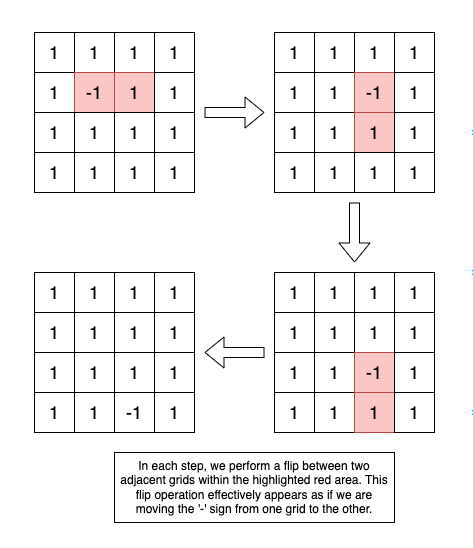

# Flip the grids in the matrix
In each step, we perform a flip between two adjacent grids within the highlighted red area. This flip operation effectively appears as if we are moving the '-' sign from one grid to the other.

Based on this approach:
- When the count of negative grids is odd, after a series of flipping steps, only a single grid retains the negative sign (we treat `0` as a negative value for simplicity).
- Conversely, if the count of negative grids is even, the flipping process ensures that no grid retains a negative sign.

