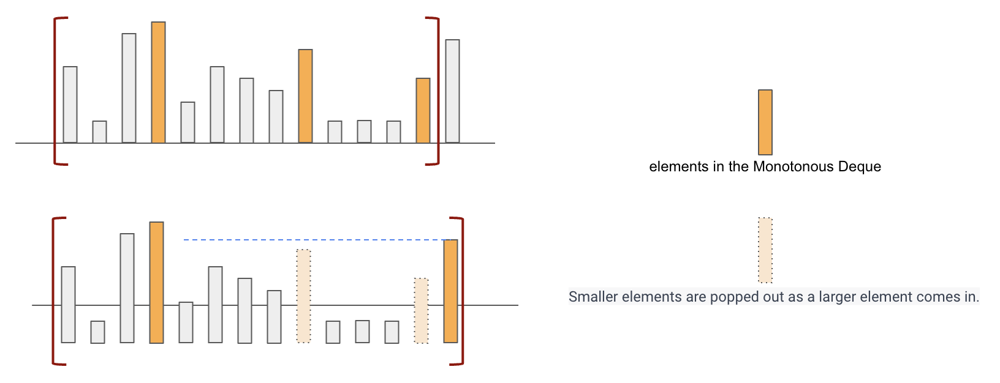

# Note of Maximum Value of a Queue
## Monotonic Queue
A Monotonic Queue is necessary to achieve `O(1)` time complexity for obtaining the maximum value.

**Tip**: All elements in the Monotonic Queue preserve the same order as the target Queue.