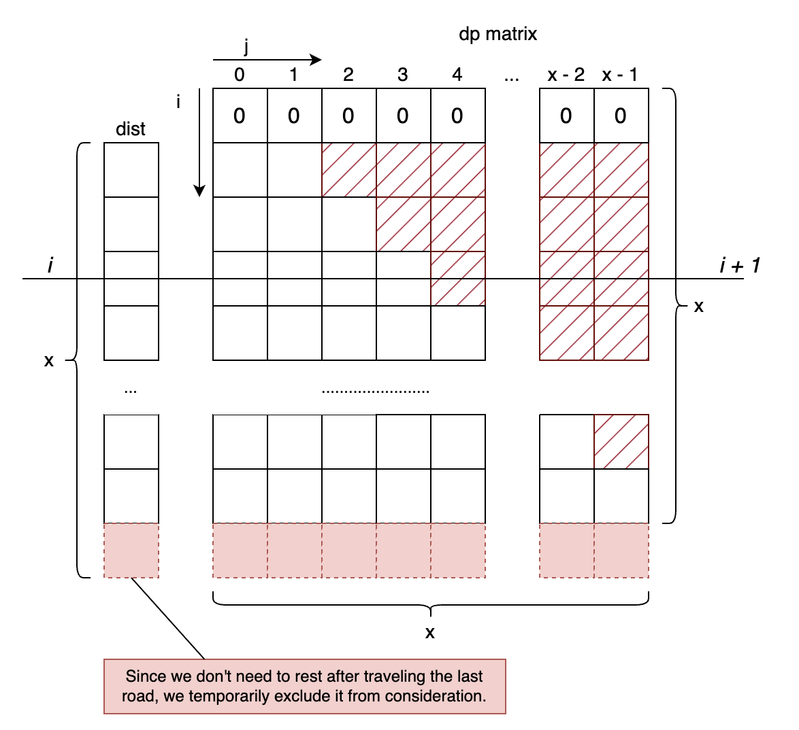

# Algorithms or Skills
## Algorithms - Dynamic programming
To address this problem, a dynamic programming (`dp`) matrix is employed, where `dp[i][j]` signifies the minimal total hours expended while traversing the `(i - 1)th` road and having already skipped `j` times rest.



Upon traversing a given road (`dist[i]`), the number of times skipped could range from 0 to `i`. Thus, within the depicted matrix, `dp[i][j]` with `j > i` is infeasible, representing unreachable states. For instance, having crossed 7 roads, skipping 8 times is an impractical scenario.
It is established by the problem's conditions that the final rest period is not permissible at the termination of the last road. Consequently, the `dp` matrix excludes coverage of the last road.

**Initial State**: Initializing the `dp` matrix involves assigning huge values to the unreachable states and setting the first row to 0, symbolizing the hours required in the absence of any road crossings.
**Transition Equation**: The transition equation is straightforward and is best comprehended through examination of the provided code.

## Skills - Floating-Point Numbers
Deviation can arise when performing operations on arithmetic floating-point numbers. Consider the equation $1.0 / 3 + 1.0 / 3 + 1.0 / 3$, which should equal 1. However, due to computational limitations, the computer might yield a value like 1.0000000000000000000000002. Rounding this value could erroneously result in 2 instead of 1. To mitigate this issue, employing a diminutive variable `eps` is recommended. This `eps` should be sufficiently small. Refer to the code for further elucidation. We should use `eps` in the following situations:
- round function. `double val = Math.ceil(a - eps);`
- comparison statement. `if(a - eps > b);`

A critical constraint in this problem is the range of speeds, bounded by $1 \leq \text{speed} \leq 10^{6}$. This implies that the smallest valid value is $10^{-6}$, which becomes relevant when considering a scenario where the distance is 1 and the speed is $10^{6}$. Consequently, to accommodate such precision requirements, it is necessary to set the value of `eps` to a value smaller than $10^{-6}$.

## Algorithm - Avoid Division
When considering the question in terms of distance, we can circumvent the need for division arithmetic operations. Take the following example:
```text
Input: dist = [1,3,2], speed = 4, hoursBefore = 2
```
In the scenario of continuing walking, we would cover 8 km within 2 hours. The total distance from home to the office is 6 km, leaving a wiggle room of 2 km. However, each instance of rest progressively reduces this wiggle room, potentially leading to a negative value, indicating the inability to reach the office punctually.

In this approach, `dp[i][j]` represents the total distance lost when crossing the `(i - 1)th` road while choosing to skip j times rest. Certainly, declining to take a break three times upon crossing three roads results in no time loss.

When calculating `dp[i][j]`, we can refer to the provided illustration. We determine `dp[i][j]` based on two scenarios:
1. Opting to skip: then we will have `dp[i][j] = dp[i - 1][j - 1]`.
2. If we opt not to skip, the question arises: what distance are we sacrificing by waiting? Based on the provided problem description, we have the equation
$$\lceil(H + \frac{d}{S})\rceil = T$$
where $H$ represents the cumulative hours spent prior to crossing this road, $S$ signifies the speed, and $d$ indicates the distance of the current road. This gives us insight into the distance we stand to lose:
$$loss = (T - (H + \frac{d}{S})) \cdot S$$
To address this question, we introduce a straightforward equation: if we have
$$\lceil(\frac{a}{b})\rceil = c$$
the process to obtain $c - \frac{a}{b}$ is as follows: We manipulate the equation as
$$\frac{a}{b} = \frac{b \cdot (c - 1)}{b} + \frac{a \mod b}{b}$$
Ultimately, we deduce that 
$$c - \frac{a}{b} = c - \frac{b \cdot (c - 1)}{b} - \frac{a \mod b}{b} = 1 - \frac{a \mod b}{b}$$
To compute the loss, we can apply this approach:
$$loss = (T - (H + \frac{d}{S})) \cdot S = (T - \frac{H \cdot S + d}{S}) \cdot S = (1 - \frac{(H \cdot S + d) \mod S}{S}) \cdot S$$
To operationalize this mathematical representation in code, the following transformation is needed:
```java
int loss = speed - (sum + dp[i - 1][j] + dist[i - 1]) % speed
```
Finally, we get
```java
dp[i][j] = dp[i - 1][j] + speed - (sum + dp[i - 1][j] + dist[i - 1]) % speed
```