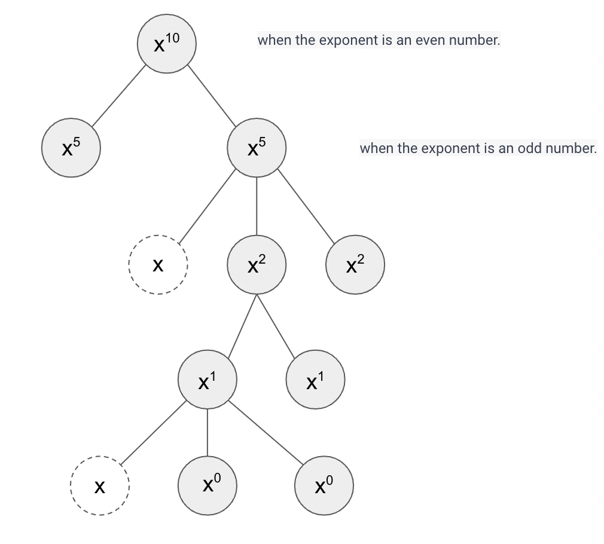

# Note of Pow(x, n)
## dfs
We can use `dfs` to calculate it.



We can optimize the calculation of $x<sup>n</sup>$ by storing the result in a temporary variable `temp` instead of calling 
`dfs(x, n) * dfs(x, n)` twice.

```java
double temp = dfs(x, n);
return temp * temp;
```

**Caveat**: Exercise caution when dealing with cases where `n` is equal to `Integer.MIN_VALUE`.

**Tips**: use `(n & 0x1) == 1` to decide its parity.