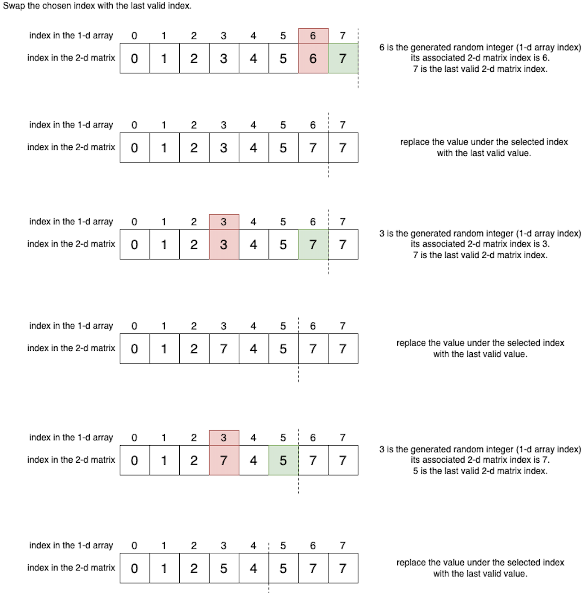

# Solutions

## Array Mapping
The core concept of this question involves transforming a two-dimensional matrix into a one-dimensional array. When generating a random integer, we move the chosen element, found at the corresponding index, to the end of the one-dimensional array. This ensures that the front part of the array only preserves the indices of the matrix that have not been flipped, while the rear part contains the flipped index. This arrangement allows us to apply the random value directly on the array. This procedure can be likened to a process of swapping the selected element with the last valid element within the one-dimensional array.

The visual depiction below provides a clear illustration of this approach:

Upon observing the image, a notable insight emerges: rather than swapping two elements, replacing the chosen element with the last valid element will be much easier.
