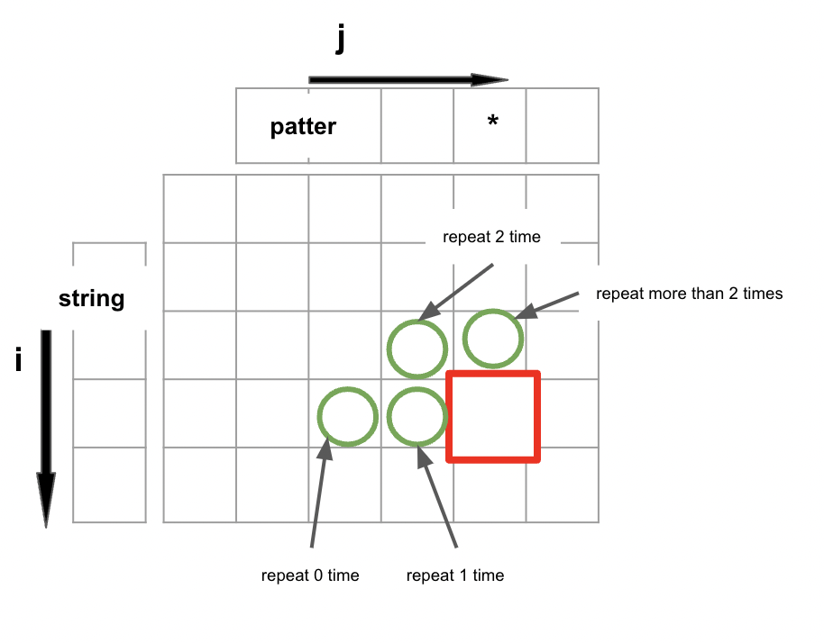
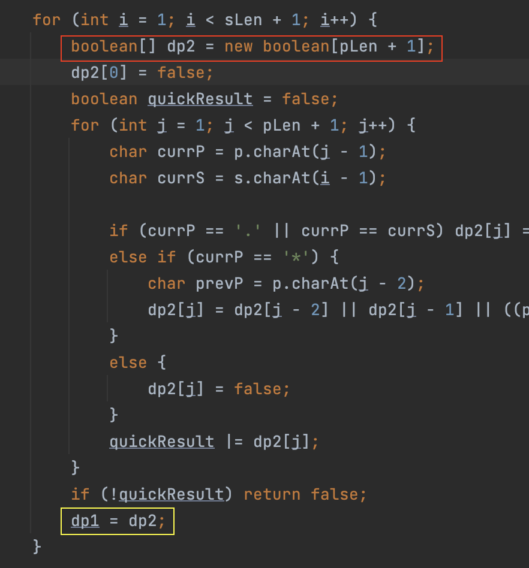

# 2D Matrix
This problem involves dynamic programming applied to substring manipulation. As with similar problems, we can use a matrix
to assist us in finding the optimal solution.

To construct this matrix, we must consider four key questions:

1. How should we initialize the matrix? Do we need to add padding to the input string to simplify the problem?
2. What is the transition equation that allows us to update the current grid based on the previous ones?
3. In what order should we fill in the cells of the matrix to ensure that we have all the necessary information for the
   final solution?".
4. When to stop?

The matrix is here: 
The matrix `dp[i][j]` represents whether the substring `p.substring(0, j)` match the substring `s.substring(0, i)`.

To determine the values of the matrix, we can follow these guidelines:

1. To ensure correct initialization of the dynamic programming matrix, we should add padding. Specifically, the first 
row and column correspond to the case where one of the inputs is empty. Therefore, to reflect the base cases accurately, 
we set `dp[0][0]` to true to indicate that an empty pattern matches an empty string. Similarly, all entries in the first 
column except `dp[0][0]` should be false, since a non-empty pattern cannot match an empty string.
2. There are three possibilities, when the current letter in the pattern is a letter, a '.' or an '*'. The '*' is the hardest
part.
   1. If '*' wants to repeat the letter 0 or 1 time, then `dp[i][j-2]` or `dp[i][j-1]` will decide the value of `dp[i][j]`.
   2. If '*' wants to repeat the letter twice, then both `dp[i-1][j-1]` and current/previous letter in the string and pattern will
   decide the value of `dp[i][j]`.
   3. If '*' wants to repeat the letter more than twice, then both `dp[i-1][j]` and current/previous letter in the string and pattern will
      decide the value of `dp[i][j]`. 
3. We should fill in the cells of the matrix in the normal order, row by row.
4. To the last cell, or we get a row of all false, we can return false.

## Optimize by scrolling array
We can observe that the value of `dp[i][j]` is determined solely by the current and previous row. As a result, we can convert the matrix
into a one-dimensional scroll array, which saves space but does not reduce the number of loop iterations.  
**Caveat:**  
  
Since `dp1` and `dp2` will point to the same memory after `dp1 = dp2`, 
we need to create a new `dp2` at the beginning of each inner loop to avoid overwriting the previous values.