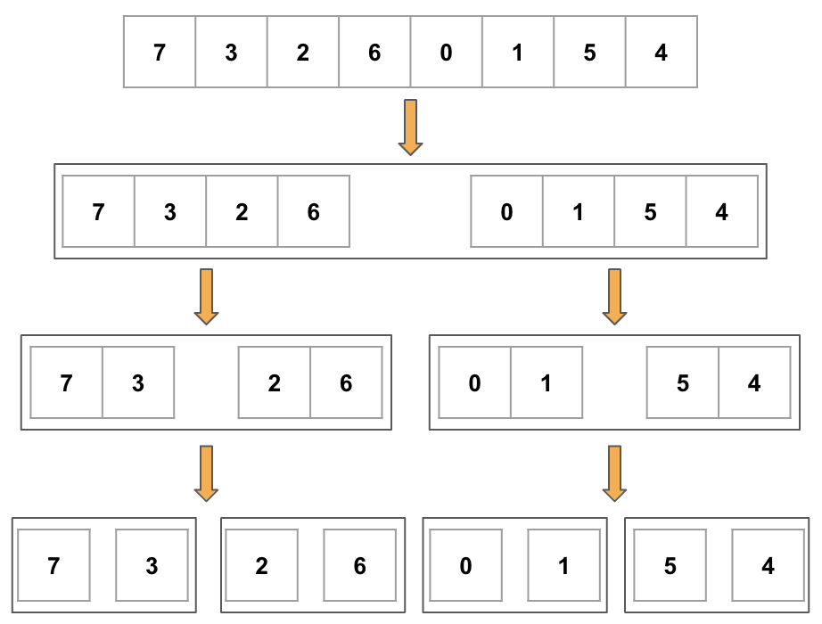
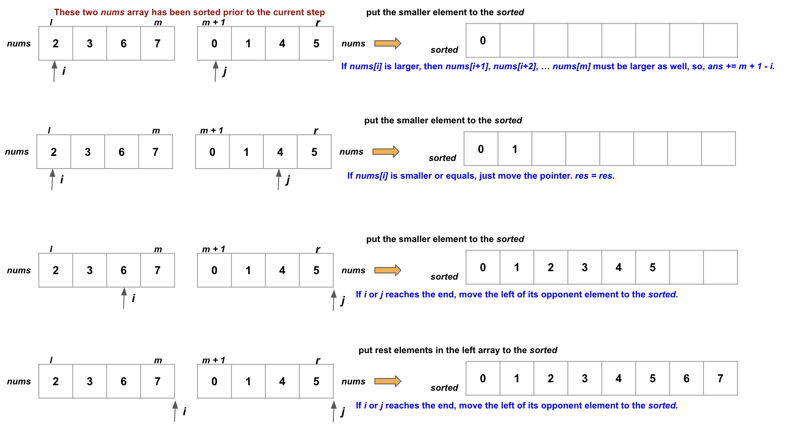
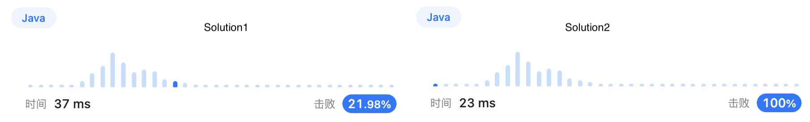
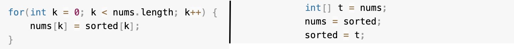

# Note of Reverse Pairs in an Array
## Merge Sort by Recursive - Solution1
To exemplify the merge-sort algorithm's processes of division and merging, we present a two-part exposition.  
This is the divisional illustration.

Then we merge and sort them.

After splitting it, the algorithm forms a tree-like structure with $log(n)$ levels. At each level, the algorithm traverses $n$ elements. Therefore, the time complexity of the algorithm is $nlog(n)$.

**Caveat**:
The splitting process bears resemblance to the dichotomous method, with **inclusive left and right edges**.

## Merge Sort without Recursive - Solution2
An advanced approach to the recursive method involves assuming that the array has already been split, and the task is to merge and sort all components. In `Solution2`, we define the variable `span` as 1, accounting for the smallest components obtained after splitting. We then iteratively merge and sort pairs of components, doubling their length at each iteration until all components are merged into one sorted array.  

The `Solution2` is much faster than the `Solution1`.

**Tip**:
When transferring all elements from the `sorted` container to `nums`, it is possible to modify the pointer directly, like the right image shows.

However, there is a caveat.  

**Caveat**:
Avoid using `nums = sorted` to swap the pointer as they share the same memory address. Subsequent insertions into `sorted` during subsequent iterations result in corresponding modifications to `nums`.
