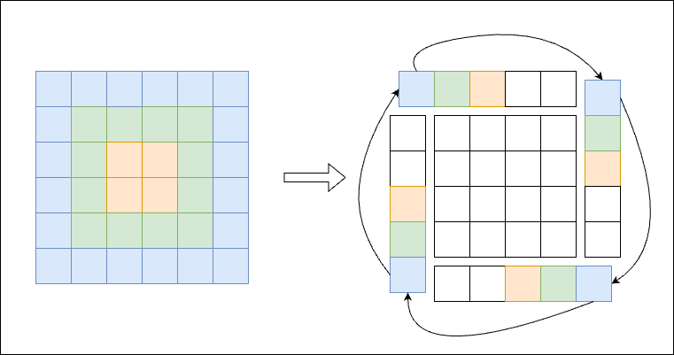

# Solution
To perform a complete matrix rotation, systematically peel the matrix layer by layer, starting from the outermost and progressing towards the innermost layer. Subsequently, divide each layer into four quadrants for ease of manipulation. Finally, rotate each grid within the quadrants to achieve the desired rotation.
