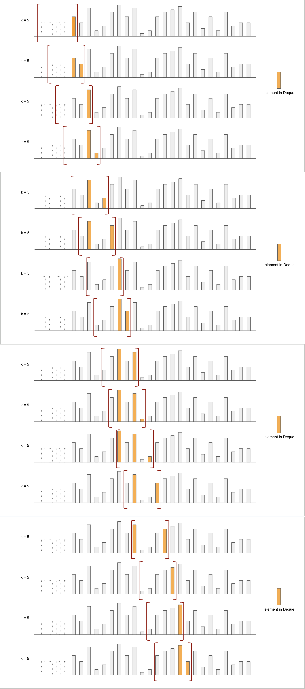

# Note of Sliding Window Maximum
## Deque & Sliding Window & Monotonic Queue 
To ensure that the rightmost element in a Deque is always the maximum value within a window, we use a Monotonic Queue 
(specifically a Deque). Additionally, we ensure that only elements within the window are allowed to be present in the 
Monotonic Deque.

**Tip**: To improve convenience, it is possible to extend the sliding window beyond the starting point of the array instead 
of initializing it at the beginning. In this particular situation, it is permissible for the sliding window to start from
`(-k, 0]` which means that the initial part of the window extends beyond the beginning of the array.