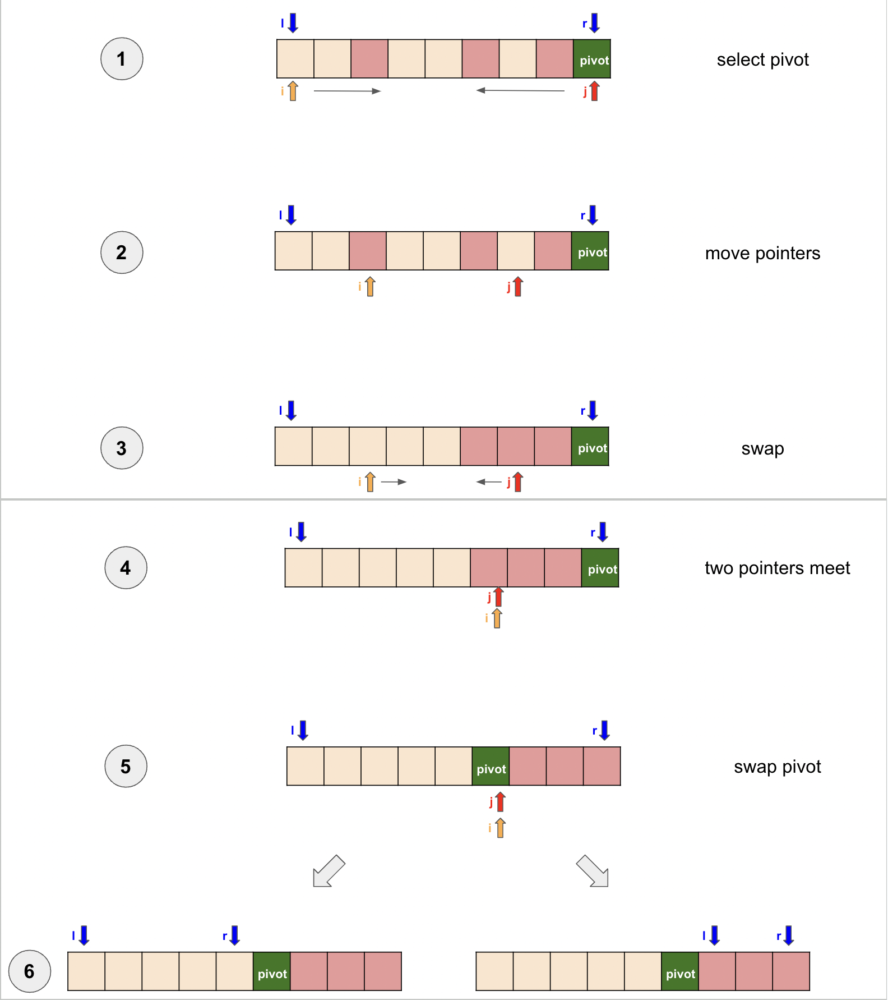

# Note of Sort Array to Minimum Number (面试题45)

# Quick Sort
We use `Quick Sort` to solve it. The illustration is here.   
The goal is to partition the array, moving smaller values to the left and larger values to the right, while ensuring 
that all values to the left of the pivot are smaller, and all values to the right are larger.

1. We start from the range `[0, length - 1]`, and set the pivot as the rightmost element in the given array. Initialize 
two pointers, one from the leftmost element and the other from the rightmost element.
2. Move the left pointer towards the center until it points to a value greater than the pivot, and move the right pointer 
towards the center until it points to a value smaller than the pivot.
3. Swap the values pointed by the left and right pointers.
4. Repeat steps 3 and 4 until the left and right pointers meet at a position called `curr`.
5. Swap the value at `curr` with the pivot.
6. Recursively apply the same process to the sub-arrays on the left and right sides of the pivot.

Note: Throughout the process, it's important to ensure that all values to the left of the left pointer are smaller than 
the pivot, and all values to the right of the right pointer are larger than the pivot, as per the definition of quick sort.