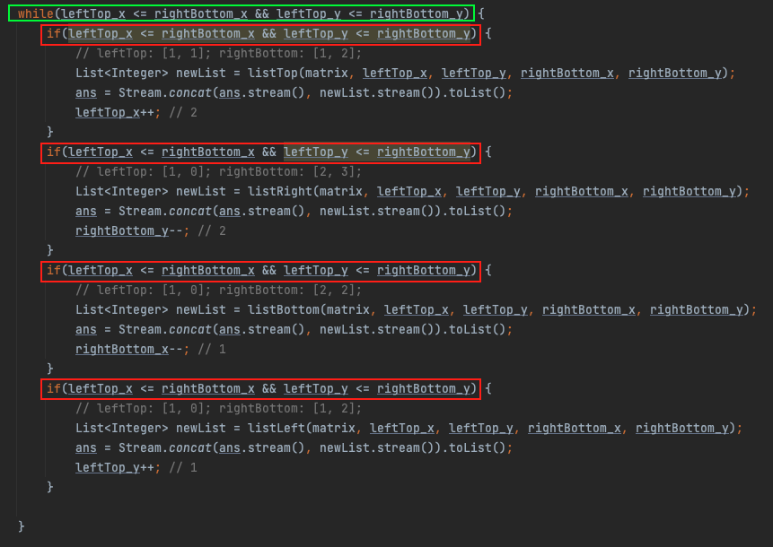

# Note of Spiral Matrix
## Matrix
1. Establish boundaries in all four directions - left, right, up, and down.
2. "squashing" the boundaries.

**Caveat**:
1. In each component of the `while` loop, it is necessary to verify `left <= right && up <= down`, as these variables 
are modified within the main loop. These four components must adhere to the same boundary conditions as the outer loop.
