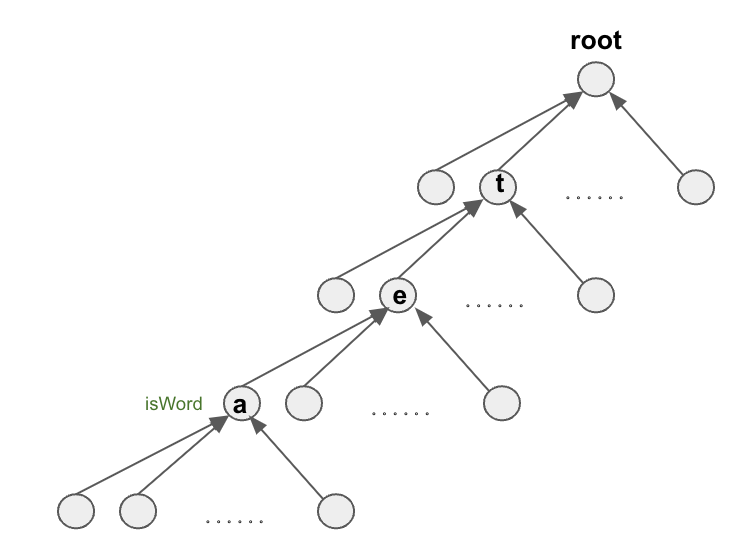

# Trie

`Trie`, like other tree structures, comprises nodes and values, typically with 26 child nodes. The `TrieNode` is defined 
with `isWord` as a distinct attribute for this particular question, while other values may be required for different 
inquiries.  

For example, the `Trie` of word `tea` is like this: 

We define `TrieNode` in this way:
```java
class TrieNode {
    TrieNode[] childNode;
    boolean isWord; // its special values, indicating the end of the inserted word

    TrieNode() {
        this.childNode = new TrieNode[26];
        this.isWord = false;
    }
}
```
We always build the `Trie` from its root.
```java
Node root = new TrieNode();
```
Note that when initializing the `Trie`, we only initialize the root node and not its child nodes. This allows the JVM
to allocate space for the child nodes, but `root.childNode` remains null. As we extend the `Trie`, we initialize one of
its child nodes and move the current pointer (`curr`) to this child node.
```java
Node curr = root;
if (curr.childNode[i] == null) {
    curr.childNode[i] = new Node();
    curr = curr.childNode[i];
}
```
So the process shows on the illustration:
We can see the current node always has allocated child nodes but the value is null.

