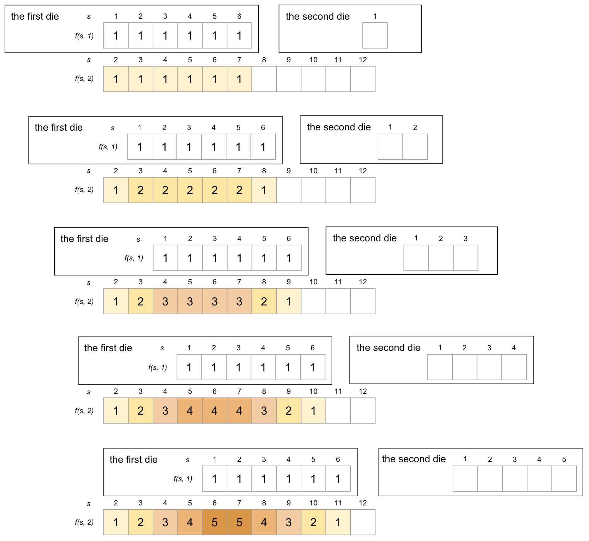

# Note of Sum of n Dice Rolls
To solve this problem, it is necessary to determine the number of permutations for each possible sum beforehand.  
We introduce two variables, $s$ and $n$, to represent the `sum` and `number of dice rolls`, respectively. Let $f(s,n)$ denote the number of permutations of each possible `sum` for $n$ dice rolls. Note that $n \leq s \leq 6n$.

## Dynamic Programming
Starts from only one die. We have this image.  

  

It is evident that there are six possible values for $s$, each with a single permutation.  

Introducing a second die with only one dot side yields the following possible values of $s$ and corresponding $f(s,n)$:  

  

Since the second die has only one dot, it can only contribute to the sum by adding 1. To calculate $f(s, 2)$ for each possible sum $s$, we can first determine $f(s-1, 1)$ by fixing the first die to have $s-1$ dots, and then add 1 with the second die to obtain the sum $s$. This process can be repeated for all possible values of $s$, resulting in the recurrence relation $f(s + 1, 2) = f(s, 1)$, where $1 \leq s \leq 6$.  

By adding a two-dot side to the second die, we introduce a new way of obtaining each possible sum $s$.Specifically, to calculate $f(s, 2)$, we can fix the first die to have $s-2$ dots, and then add 2 with the second die. This leads to the recurrence relation $f(s+2, 2) = f(s, 1) + f(s+1, 1)$, where $1 \leq s \leq 6$.  

  

As more faces are added to the second die, the following images illustrate the step-by-step process for computing $f(s, 2)$ for each possible sum $s$.  

  

The process for computing $f(s, 2)$ can be visualized as sliding the $f(s, 1)$ along the $f(s, 2)$, and sum the corresponded values.  

  

To compute $f(s, 3)$, a similar sliding process is used, but this time the values of $f(2, s)$ are shifted along the range of values for $f(s, 3)$. The first two steps of this process are shown in the following image.  

  

In the code, we implement the sliding process by using two integer arrays: `dp1` for $f(s, n-1)$ and `dp2` for $f(s, n)$. We slide the `dp1` along the `dp2` to obtain the updated values for `dp2`.  
In a nutshell, we get $f(s, n)$ from $f(s, 1)$.

## dfs 
Theoretically, the solution to this question can be obtained using the depth-first search algorithm, wherein the calculation is based on the function $f(s,n)$ derived from $f(s,n-1)$. However, it is important to note that the time complexity of this approach is $6^n$.