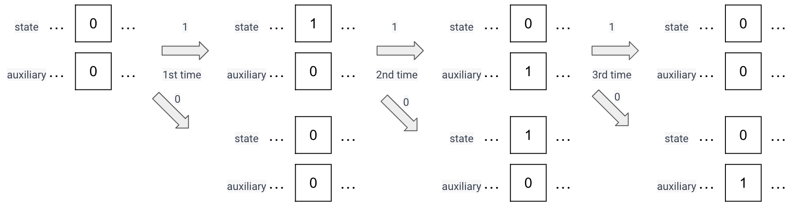
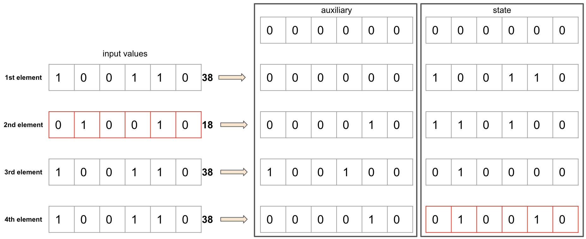
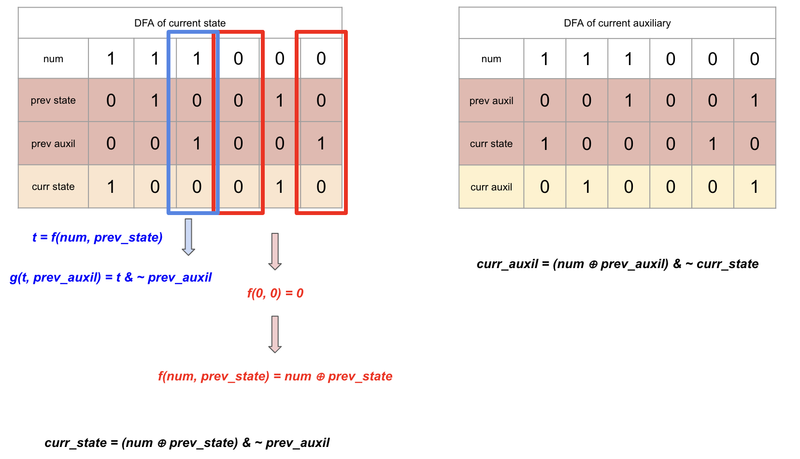

# Note of The Occurrences of a Number in an Array II
## Finite-State Machine (FSM)
Building upon the idea from "The Occurrences of a Number in an Array I," we can introduce a new operator $\odot$ that 
satisfies the property:

$$a \odot a \odot a=0$$

With this operator, we can efficiently solve the problem of summing up all the elements in an array with a time complexity of `O(n)`.

To create the desired operator, we must first convert all the input values into their binary representation. We can then 
use two variables, `state` and `auxiliary`, which are both initialized to 0. These variables will keep track of the current 
state of the operator as we apply it to each binary digit of the input values.

As we iterate through the binary representation of each value, we check if the current bit is a `1`. If it is, we update
both `state` and `auxiliary` according to the following rules:

1. (`State A`) If this is the first `1` we have encountered for the current position, we update the corresponding bit in
`state` to `1`.
2. (`State B`) If this is the second `1` we have encountered for the current position, we update the corresponding bit 
in `auxiliary` to 1 and update `state` to `0`.
3. (`State C`) If this is the third `1` we have encountered for the current position, we reset both `state` and `auxiliary` 
for that position by setting the corresponding bits to `0`.

By following these rules, we ensure that for any given position in the binary representation of the input values, the 
corresponding bits in `state` and `auxiliary` will be `0` whenever a `1` appears every three times.  
Pay attention, all bits in the binary representation of input values are mutual independent according to this rule.  
The illustration shows how it works

This is how we design the operator.

**Caveats**:
1. When calculate `curr_auxil`, we need to use `curr_state` instead of `prev_state`.
2. When designing the new operator, it is essential to consider both the cases when the binary digit is `1` and when it 
is `0`. Neglecting either case can result in an incorrect operator.