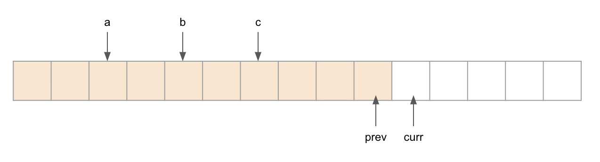

# Note of Ugly Number II
## Dynamic Programing
According to the given definition of ugly numbers, if $x_{curr}$ is an ugly number, then 
$$x_{curr} = min (2x_a, 3x_b, 5x_c)$$. By finding the values of $a$, $b$, and $c$, we can obtain the current ugly number $x_{curr}$.  
If we define $prev$ as the index of previous ugly number ($prev=curr-1$), then we have $x_{curr} > x_{prev}$. To find the current ugly number, we need to update the values of $a$, $b$, and $c$ to ensure that:
$$2x_a > x_{prev}$$
$$3x_b > x_{prev}$$
$$5x_c > x_{prev}$$

