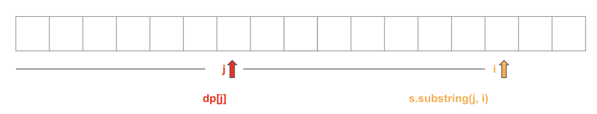

# Dynamic Programming
This is a 1-D dynamic programming question, although it involves a string.  
In the code `dp[x]` represents if `s.substring(0, x)` could be broken.  
We also have `dp[x] = dp[t] && isWord(s.substring(t, x))`

# Dynamic Programming with Knapsack
Optimize the algorithm by using a knapsack approach instead of moving the pointer `j` one grid at a time in the range 
`[0, i)`. `dp[i]` will only be set to true if `s.substring(j, i)` is a word in `wordDict`.  

