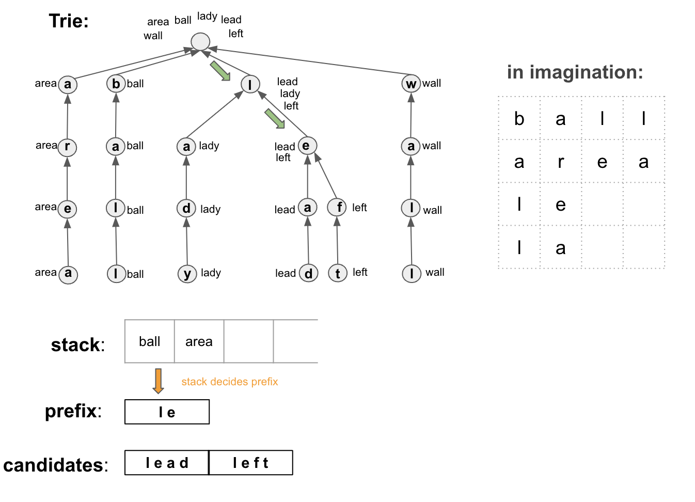

# Note of Word Squares
The illustration makes it quite easy to understand.

To solve this problem, it is essential to get the prefix and search all candidates by traversing the `Trie`. Then update
the prefix and try again. DFS is used to trace back.