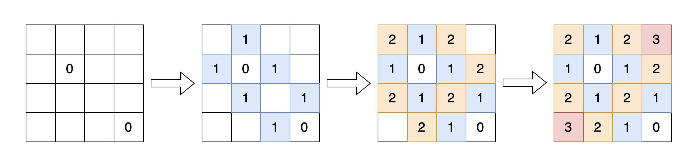
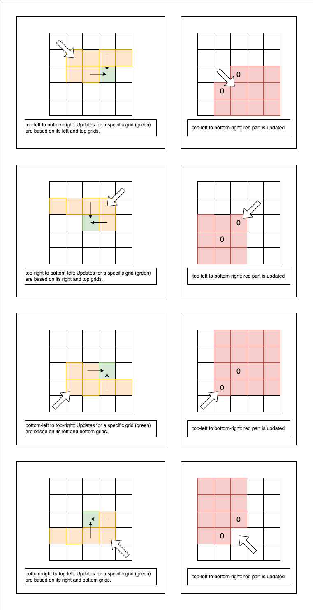

# Solution
## Solution1 - Breath Search First
This question begins at the `0` grid and spreads out to populate all grids. We employ a `Queue` to store the traversed grids.



## Solution2 - Dynamic Programming
The unique aspect of this question lies in our utilization of four distinct dynamic programming techniques to attain the final outcome. We employ four traversal approaches to achieve this:
- Top-left to bottom-right: Considering on the shortest distance from a grid to the `0` cell in its upper-left quadrant.
- Top-right to bottom-left: Considering on the shortest distance from a grid to the `0` cell in its upper-right quadrant.
- Bottom-left to top-right: Considering on the shortest distance from a grid to the `0` cell in its lower-left quadrant.
- Bottom-right to top-left: Considering on the shortest distance from a grid to the `0` cell in its lower-right quadrant.



# Caveat
## Max Integer Initialization 
When initializing the matrix, refrain from populating it with `Integer.MAX_VALUE`. This precaution is necessary as we utilize the following code snippet to update the `distance` matrix:
    ```java
    distances[i][0] = Math.min(distances[i][0], distances[i - 1][0] + 1);
    ```
    Should `distances[i - 1][0]` retain its initial value of `Integer.MAX_VALUE`, the addition of `1` would result in `Integer.MIN_VALUE`.
